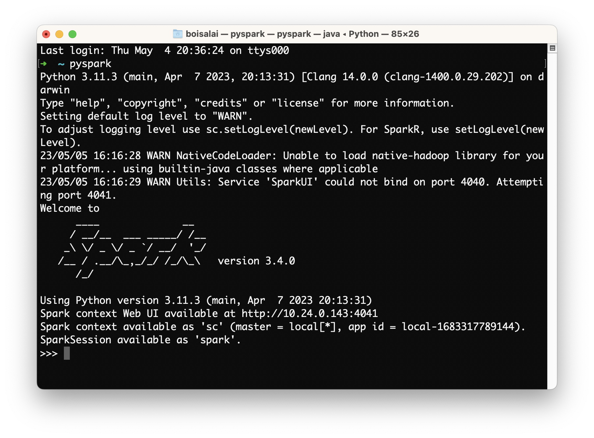
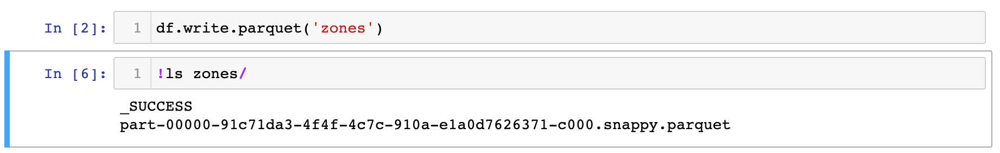

# Install PySpark in Anaconda & Jupyter Notebook

This page partially applies the instructions of:

* [Install PySpark in Anaconda & Jupyter Notebook](https://sparkbyexamples.com/pyspark/install-pyspark-in-anaconda-jupyter-notebook/),
January 9, 2023.
* DataTalksClub Data Engineering Zoomcamp [here](https://github.com/DataTalksClub/data-engineering-zoomcamp/blob/main/week_5_batch_processing/setup/macos.md) and [here](https://github.com/DataTalksClub/data-engineering-zoomcamp/blob/main/week_5_batch_processing/setup/pyspark.md).

My computer is a MacBook using Zsh and Homebrew.

## Install Java

Install Brew and Java, if not already done.

```bash
# Install Homebrew.
xcode-select –install /bin/bash -c "$(curl -fsSL https://raw.githubusercontent.com/Homebrew/install/master/install.sh)"
# Install Java.
brew install java
java -version
# openjdk version "11.0.19" 2023-04-18
# OpenJDK Runtime Environment Homebrew (build 11.0.19+0)
# OpenJDK 64-Bit Server VM Homebrew (build 11.0.19+0, mixed mode)
```

Find where Java is installed.

* Running `brew list` shows a list of all your installed Homebrew packages. You should see `openjdk@11`.
* Running `which brew` indicates where brew is installed. Brew is installed in `/opt/homebrew/bin/brew`.
* Searching around this directory, I find that java is installed in `/opt/homebrew/Cellar/openjdk@11/11.0.19`.

Add these instructions in `~/.zshrc` file.

```bash
export JAVA_HOME="/opt/homebrew/Cellar/openjdk@11/11.0.19"
export PATH="$JAVA_HOME/bin:$PATH"
```

## Install Scala

This [page](https://www.scala-lang.org/download/all.html) shows that the current version for Scala 2 is 2.13.10. So I run this command.

```bash
brew install scala@2.13
```

Add these instructions to `~/.zshrc` file.

```bash
export SCALA_HOME="/opt/homebrew/opt/scala@2.13"
export PATH="$SCALA_HOME/bin:$PATH"
```

## Install Apache Spark

Run this command.

```bash
brew install apache-spark
```

Then, add these instructions to `~/.zshrc` file.

```bash
export SPARK_HOME="/opt/homebrew/Cellar/apache-spark/3.4.0/libexec"
export PATH="$SPARK_HOME/bin:$PATH"
```

Finally, run this command: `source ~/.zshrc`.

## Testing Spark

In the terminal, execute `spark-shell` and run the following in scala. You can ignore the warnings.

```scala
val data = 1 to 10000
val distData = sc.parallelize(data)
distData.filter(_ < 10).collect()
```

We should see this.


To quit Spark shell, you press `Ctrl+D` or type in `:quit` or `:q`.

## Install PySpark

To run PySpark, we first need to add it to `PYTHONPATH`.

`PYTHONPATH` is a special environment variable that provides guidance to the Python interpreter about where to find various libraries and applications. 
See [Understanding the Python Path Environment Variable in Python](https://www.simplilearn.com/tutorials/python-tutorial/python-path) for more information.

So, I add these instructions to `~/.zshrc` file.

Make sure that the version under `$SPARK_HOME/python/lib/` matches the filename of `py4j` or you will encounter `ModuleNotFoundError: No module named 'py4j'` 
while executing `import pyspark`.

```bash
export PYTHONPATH="/opt/homebrew/Cellar/python@3.10/3.10.11"
export PYTHONPATH="${SPARK_HOME}/python/:$PYTHONPATH"
export PYTHONPATH="${SPARK_HOME}/python/lib/py4j-0.10.9.7-src.zip:$PYTHONPATH"
```

Finally, run `source ~/.zshrc`.

## Install FindSpark

In order to run PySpark in Jupyter notebook first, you need to find the PySpark Install, I will be using findspark package to do so. 
Since this is a third-party package we need to install it before using it.

```bash
conda install -c conda-forge findspark
```

## Validate PySpark Installation 

Now let's validate the PySpark installation by running `pyspark` shell. This launches the PySpark shell where you can write PySpark programs interactively.



To quit PySpark shell, you press `Ctrl+D` or type in `exit()`.

Now you can run Jupyter to test if things work.
Run `jupyter notebook`, create a new notebook with the Python 3 (ipykernel) and execute this:

```python
import pyspark
from pyspark.sql import SparkSession

!wget https://s3.amazonaws.com/nyc-tlc/misc/taxi+_zone_lookup.csv

# We now need to instantiate a Spark session, an object that we use to interact with Spark.
spark = SparkSession.builder \
    .master("local[*]") \
    .appName('test') \
    .getOrCreate()

df = spark.read \
    .option("header", "true") \
    .csv('taxi+_zone_lookup.csv')

df.show()
```

Note that:

* `SparkSession` is the class of the object that we instantiate.
  * `builder` is the builder method.
* `master()` sets the Spark master URL to connect to.
  * The `local` string means that Spark will run on a local cluster.
  * `[*]` means that Spark will run with as many CPU cores as possible.
* `appName()` defines the name of our application/session. This will show in the Spark UI.
* `getOrCreate()` will create the session or recover the object if it was previously created.

Similarlly to pandas, Spark can read CSV files into dataframes, a tabular data structure. Unlike pandas, 
Spark can handle much bigger datasets but it’s unable to infer the datatypes of each column.

We should see some thing like this.


Test that writing works as well:

```python
df.write.parquet('zones')
```


